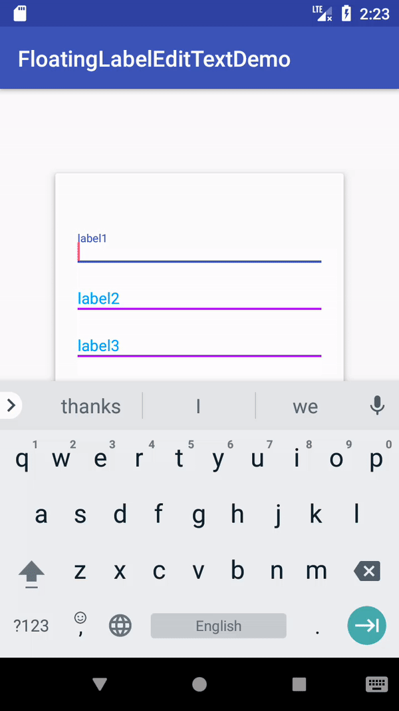

# FloatingLabelEditTextDemo
# Reference
[FloatingLabelEditText](https://github.com/james602152002/FloatingLabelEditText)
# Demonstration
|Customize Clear Button|
|:---:|
||
## Dependency:
 
 ```
 allprojects {
 	repositories {
 		...
 		maven { url 'https://jitpack.io' }
 	}
 }
 ```
 
 ```
 dependencies {
 	compile 'com.github.james602152002:FloatingLabelEditText:1.2.0'
 }
 ```
 
 ## Property
 ```xml
 <com.james602152002.floatinglabeledittext.FloatingLabelEditText
           //set focus status color
           app:j_fle_colorHighlight="#0000FF" 
           //set divider color when you are not in focus status
           app:j_fle_colorDivider="#FF00FF"
           //set error status color
           app:j_fle_colorError="#0000FF"
           //set label text and hint
           app:j_fle_hint="label"
           //set thickness of divider
           app:j_fle_thickness="2dp"
           //set label horizontal margin
           app:j_fle_label_horizontal_margin="2dp"
           //set label vertical margin
           app:j_fle_label_vertical_margin="2dp"
           //ser error text horizontal margin
           app:j_fle_error_horizontal_margin="2dp"
           //set divider vertical margin
           app:j_fle_divider_vertical_margin="2dp"
           //set floating label text size
           app:j_fle_label_textSize="14sp"
           //set error text size
           app:j_fle_error_textSize="14sp"
           //set floating label animation duration(unit：ms)
           app:j_fle_float_anim_duration="800"
           //set error sliding text animation duration(unit：ms)
           app:j_fle_error_anim_duration="8000"
           //validate error mode disable(default enabled)
           app:j_fle_error_disable="true"
           //enable multiline mode(default disabled)
           app:j_fle_multiline_mode_enable="true"
           //enable clear button mode(default disabled)
           app:j_fle_enable_clear_btn="true"
           //set clear button size
           app:j_fle_clear_btn_size="10dp"
           //set clear button color
           app:j_fle_clear_btn_color="#FF0000"
           //set clear button horizontal margin
           app:j_fle_clear_btn_horizontal_margin="2dp"
           //set clear button drawable or vector drawable id
           app:j_fle_clear_btn_id = "@drawable/icon"
           //Even your edit text doesn't have focus, your clear button still show at right.(default invisible)
           app:j_fle_show_clear_btn_without_focus="true"
           />
           
 ```
 
 ## Method
 ```java
 public void setting(){
    //set focus status color
    setHighlightColor(int color);
    //set divider color when you are not in focus status
    setDivider_color(int divider_color);
    //set error status color
    setError_color(int error_color);
    //set label text and hint
    setLabel(CharSequence hint);
    //set thickness of divider
    setThickness(int thickness);
    //set label horizontal and vertical margin
    setLabelMargins(int horizontal_margin, int vertical_margin);
    //ser error text horizontal margin
    setErrorMargin(int horizontal_margin);
    //set divider vertical margin
    setDivider_vertical_margin(int divider_vertical_margin);
    //set floating label text size
    setLabel_text_size(float label_text_size);
    //set error text size
    setError_text_size(float error_text_size);
    //set floating label animation duration(unit：ms)
    setAnimDuration(int ANIM_DURATION);
    //set error sliding text animation duration(unit：ms)
    setErrorAnimDuration(int ERROR_ANIM_DURATION);
    //enable error mode
    setError_enabled();
    //disable error mode
    setError_disabled();
    //enable multiline mode(default disabled)
    setMultiline_mode(boolean enable);
    //enable clear button mode(default disabled)
    enableClearBtn(boolean enable);
    //set clear button size
    setClear_btn_size(int clear_btn_size);
    //set clear button color
    setClear_btn_color(int clear_btn_color);
    //set clear button horizontal margin
    setClear_btn_horizontal_margin(int clear_btn_horizontal_margin);
    //customize your clear button by ttf
    customizeClearBtn(Typeface typeface, String uni_code, int color, int clear_btn_size);
    //customize png or VectorDrawable clear button
    customizeClearBtn(int drawableId, int clear_btn_width);
    //Even your edit text doesn't have focus, your clear button still show at right.
    showClearButtonWithoutFocus();
 }
```

## Demonstration

```java
public class MainActivity extends AppCompatActivity implements View.OnClickListener {
    private FloatingLabelEditText label_1;

    @Override
    protected void onCreate(Bundle savedInstanceState) {
        super.onCreate(savedInstanceState);
        setContentView(R.layout.activity_main);
        label_1 = findViewById(R.id.label_1);
        label_1.addValidator(new RegexValidator("long error hint", "\\d+"));
        label_1.addValidator(new RegexValidator("You input letters.", "[A-Za-z]+$"));
        label_1.customizeClearBtn(Typeface.createFromAsset(getAssets(), "iconfont.ttf"), "&#xe86d;", Color.GREEN, dp2px(10));
        AppCompatButton button = findViewById(R.id.submit);
        button.setOnClickListener(this);

        //png bitmap clear button label
        FloatingLabelEditText label3 = findViewById(R.id.label_3);
        label3.customizeClearBtn(R.drawable.umeng_socialize_qq_on, dp2px(12));

        //vector drawable clear button label
        FloatingLabelEditText label4 = findViewById(R.id.label_4);
        label4.customizeClearBtn(R.drawable.ic_wifi_black_24dp, dp2px(12));
    }

    private int dp2px(float dpValue) {
        return (int) (0.5f + dpValue * getResources().getDisplayMetrics().density);
    }

    @Override
    public void onClick(View v) {
        label_1.setError("submit error");
    }
}
```